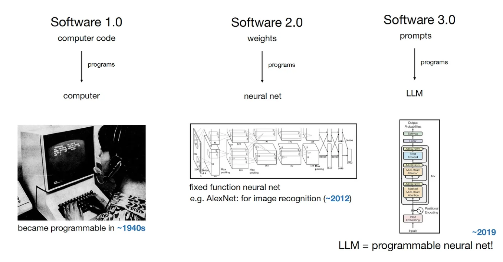
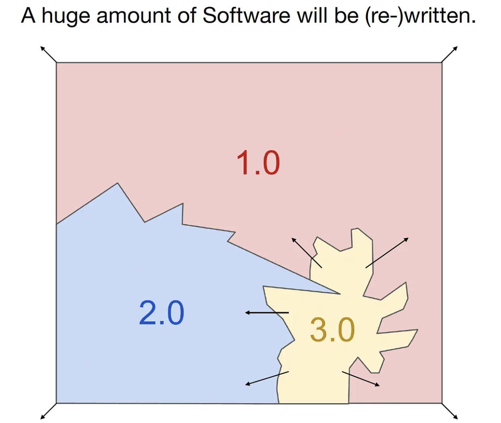
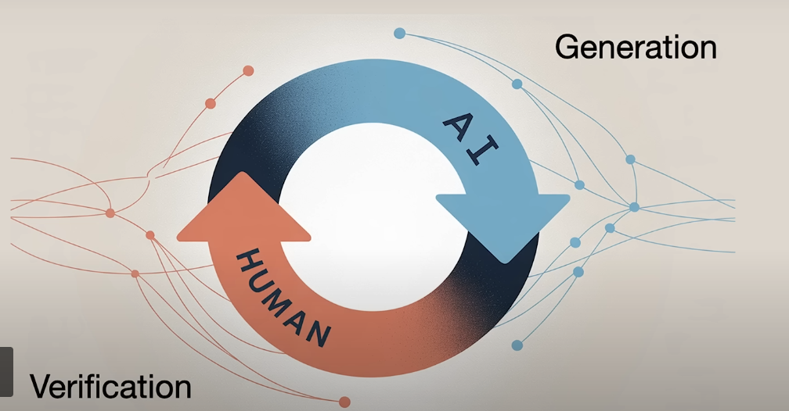

# Self-intro

- 2018 - 2020 University of Melbourne Graduate in Information Technology
- 2019 - 2020 Data Engineer in a startup
- 2020 - 2025 REA Group
- Teaching experiences: tutoring Data Warehousing, Modelling Complex Software Systems, Business Analytics in Action capstone

---

# Why start CLG Data Camp
- Gap between school and industry demand
- Community

---

- AI trend
  - Anyone can do vibe coding  
  - AI is limited in solving any complexity that requires domain knowledge and clarification
  - More opportunities

---

---

---

<small><i>Ref: https://www.youtube.com/watch?v=LCEmiRjPEtQ </small></i>

---

# Why start with Python
- Beginner friendly to learn programming paradigm
- Enriched features (ML, DE, Automation, SE)
