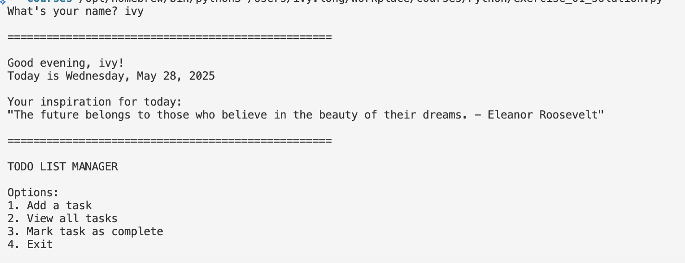

## Daily Briefing Generator

This program will create a customized daily briefing every time you run it.

### What You'll Learn:
- Using conditional logic to personalize output
- Working with date and time
- Reading from and writing to files
- Generating random selections
- Building a simple menu system

### Skills Practiced:
- String formatting
- User input handling
- File operations
- Conditional logic
- Loops for menu systems

Note: You will need to use Python Standard Library
- Importing and using modules like random and datetime.
- Formatting dates and times (strftime).

# Helpful Resources

## Importing and Using Modules like random and datetime
- [Python Modules and Packages – Real Python](https://realpython.com/python-modules-packages/)
- [Python random Module Documentation](https://docs.python.org/3/library/random.html)
- [Python datetime Module Documentation](https://docs.python.org/3/library/datetime.html)
- [Beginner's Guide to Python Modules – Programiz](https://www.programiz.com/python-programming/modules)

## Formatting Dates and Times (strftime)
- [Python strftime() and strptime() Format Codes](https://docs.python.org/3/library/datetime.html#strftime-and-strptime-format-codes)
- [How to Format Dates in Python – W3Schools](https://www.w3schools.com/python/python_datetime.asp)
- [Python DateTime Formatting – Programiz](https://www.programiz.com/python-programming/datetime/strftime)

These resources include official documentation and beginner-friendly tutorials to help you understand and practice these concepts.